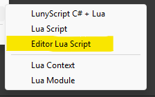


#### [Back to Index](index.md)

# Create Your First Editor Lua Script 

I encourage you to have your editor window sized so that you can see the Unity Editor's 'Console' window somewhere on the side.

Type often, save often, watch the changes happen in the Console by 'printing' a lot of things and to get a feel for hot reloading. For logging you can use any of these:
```
print("Hello!")    -- Debug.Log equivalent
log("Hello!")      -- same as 'print'
warn("Hello!")     -- Debug.LogWarning equivalent
error("Hello!")    -- Debug.LogError equivalent
```

## Example Editor Script
Use case: We need an Editor utility script that automatically opens new Scene assets.

Exactly the kind of script we often wish for but rarely write because of the friction imposed upon us. Particularly when we need to figure many things out one by one:

- What class is this callback in again?
- Oh god .. which of these callbacks to use?
- Are these static events I can subscribe to or do I have to subclass?
- Could these parameters be null, or empty?
- Are these `string[]` parameters paths?
- If so, absolute or relative?
- What's the file extension for scenes again?
- How to open a scene, but in the Editor?

That's several minutes wasted on just compiling the C# code multiple times in quick succession. You got actual work to do, remember?

Here's the full **Luny** solution, I'll explain it in detail next:
```
local script = ...

script.OnPostprocessAllAssets = function(imported)
    if #imported == 1 and imported[1]:EndsWith(".unity") then
        EditorSceneManager.OpenScene(imported[1]);
    end
end
```

## Your First Editor Script

Create a new Editor Lua script in a `/Editor` folder:



If you're not in a

Capture the script's context table in a local variable, where `...` is Lua's _varargs_ keyword similar to C# `params`:
```
local script = ...
```

Implement event functions in the script table, using the same name as the C# callback:
```
script.OnPostprocessAllAssets = function(imported, deleted, moved, movedFrom)
    print("Asset Postprocessing, imported count: " .. #imported)
end
```

You can omit unused, trailing arguments for clarity and brevity:
```
script.OnPostprocessAllAssets = function(imported)
end
```

Lua understands english, naturally uses `1` as a list's first element, and counts elements with the `#` prefix:
```
if #imported == 1 and imported[1]:EndsWith(".unity") then
end
```

Since `imported[1]` is a string, we can call a function that operates 'on' a string by using the `:` (colon) operator:
```
imported[1]:EndsWith(".unity")
```

The `:` operator is syntactic sugar for the more verbose alternative, resembling a C# static method call:
```
string.EndsWith(imported[1], ".unity")
```

Both `UnityEditor` and `UnityEngine` APIs are at your disposal, these are merely tip-of-the-iceberg examples:
```
-- static method call:
EditorSceneManager.OpenScene("Main Scene.unity");

-- some vector math:
local input = Vector3(10, 20, 30)
local velocity = input.normalized * Time.deltaTime
```

Saving reloads the script without having to change window focus. Anything in the script context table survives reload:
```
local script = ...
script.Reloads = script.Reloads and script.Reloads + 1 or 1
print("Reloaded script " .. script.Reloads .. " times")
```

The `..` operator concatenates strings. You may be more curious about the `and or` pattern though. It's what we call a ternary expression:
```
(condition) ? (consequent) : (alternative)      // C# ternary expression
(condition) and (consequent) or (alternative)   -- Lua ternary equivalent
```

The ternary expression is used because all variables default to the value `nil`. Lua's keyword for `null` actually means: "value not assigned". The first time this script runs, we will have to assign a `number` value since we cannot increment a `nil` value.

You can also write this logic more traditionally:
```
if not script.Reloads then 
    script.Reloads = 0
end

script.Reloads = script.Reloads + 1 
```

If you're very accustomed to C languages, you may prefer to use the equality operator. Its inequality counterpart is the `~=` operator, which - I promise - you'll get used to:
```
if script.Reloads == nil then
    script.Reloads = 0
end
```
A `nil` value evaluates to false in a boolean condition.

Like in C#, some of us prefer longer over more lines. At least for very short, simple statements it can be a useful formatting alternative:
```
if script.Reloads == nil then script.Reloads = 0 end
```
I could show you how you can make multiple statements on the same line, but I do not wish to endorse this style.

If you ever find need for structuring things, use a table. The table is Lua's sole collection type, mimicking both a list and a key-value store. How you format the braces is entirely up to you:

```
local myTable = {
    tableInsideTheTable = { "This", "Is", "A", "List", "Of", "Strings", "!", },
    TheNumberWeShallCallPI = 3.1415,
    doesAnyOfThisMakeSense = false,
    aDeeperTable =
    {
        name = "Knee-deep",
        evenDeeperTable = { name = "in the Tables" }
    }
}
```

A table is highly suitable for hierarchical structures, including storing game and configuration data. But unlike certain structured text formats it's actually executable **and** it supports comments **and** doesn't mind trailing commas.
Above code contains an example. Did you notice?

Some example use-cases for embedded functionality right in the game and config data:

- generate or initialize content
- choose which content to load
- validate, optimize, analyze, format, or convert the content
- send a webrequest before returning

What you can't do: mining bitcoins on user's devices. Generally speaking.

Most IDEs and text editors support syntax highlighting, error checking, and auto-completion suggestions for Lua, either built-in or via a plugin. Check your editor's plugin manager.

#### [Back to Index](index.md)
