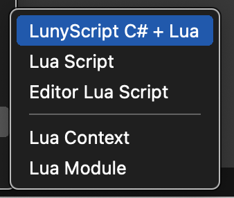
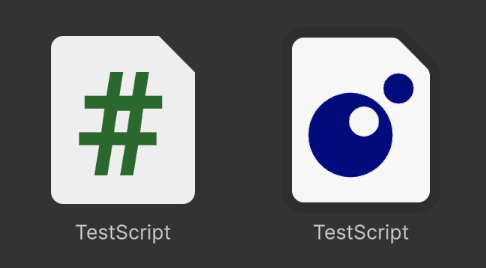
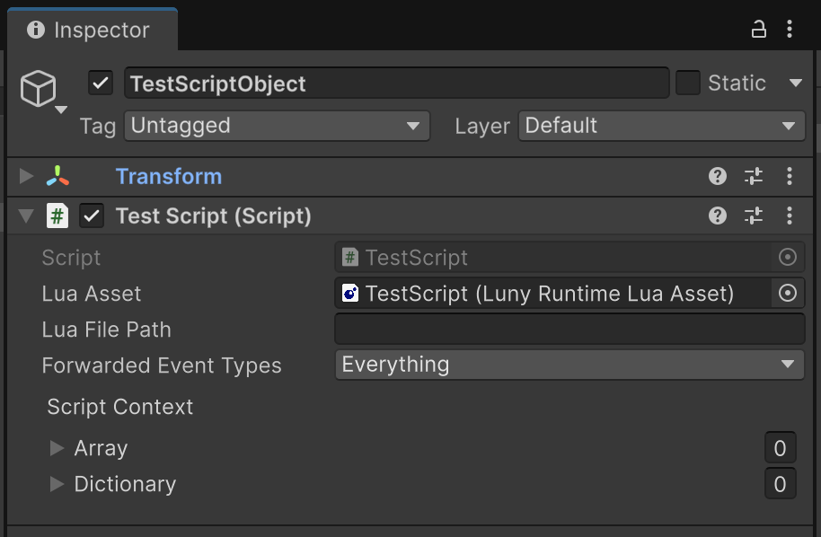
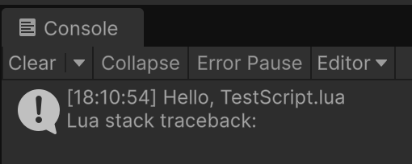
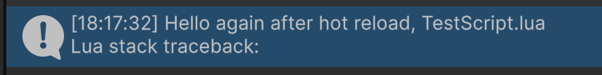


#### [Back to Index](index.md)

I encourage you to have your editor window sized so that you can see the Unity Editor's 'Console' window somewhere on the side.

Type often, save often, watch the changes happen in the Console by 'printing' a lot of things and to get a feel for hot reloading. For logging you can use any of these:
```
print("Hello!")    -- Debug.Log equivalent
log("Hello!")      -- same as 'print'
warn("Hello!")     -- Debug.LogWarning equivalent
error("Hello!")    -- Debug.LogError equivalent
```

# Create Your First Runtime Script

Let's move an object at runtime through a Lua script.

## Create a C# + Lua Script Pair

In the Project view, navigate to a folder where you want to create the scripts. It should not be an "Editor" folder or assembly.

Right-click and choose `Create / Luny / LunyScript C# + Lua`:



After naming the asset - for example "TestScript" - two assets will be created: a C# (TestScript.cs) and accompanying Lua (TestScript.lua) asset.



Create a GameObject in the scene. Choose any GameObject that is visible, like `3D Object/Cube` or `2D Object/Sprites/Square`.

Then select the new GameObject. Drag & drop the C# script from the Project window onto the GameObject's Inspector window. Alternatively use **Add Component** in the Inspector to add the C# script. It should look similar to this:



Since the Lua script has the same name as the C# script it will automatically get assigned to the _Lua Asset_ field.

## Hot Reloading

Enter playmode now. You should get a message printed to the Console from the Lua script:



Stay in playmode. Open the Lua script. Edit the string that gets logged. Save the Lua script. 

```
-- assign script's context table to a local variable (... is Lua's varargs operator):
local script = ...

-- Unity event messages call Lua functions of the same name in the 'script' table:
script.OnEnable = function()
    print("Hello again after hot reload, " .. script.Name .. ".lua")
end
```

Notice how the changed Console message gets printed immediately after saving:



## Let's Move It!

Now let's move the GameObject around in the scene for a simple visual test.

Add the following Update function to the Lua script:
```
script.Update = function()
    local x = script.transform.position.x
    script.transform.position = Vector3(x + 0.1 * Time.deltaTime, 0, 0)
end
```

Enter Playmode and observe the GameObject moving around. Keep changing the script and save, and observe how each change takes effect immediately. For instance you could change the + to - to make it move in the opposite direction. Or change the 0.1 to 0.2 to make it move faster.

## Let's Inspectorize these values!

You can also edit values in the `script` table via the Inspector.


#### [Back to Index](index.md)
