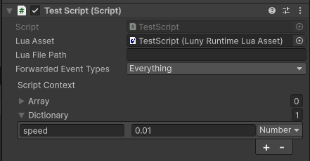
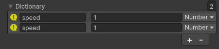
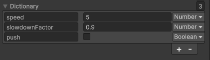


#### [Back to Index](index.md)

I encourage you to have your editor window sized so that you can see the Unity Editor's 'Console' window somewhere on the side.

Type often, save often, watch the changes happen in the Console by 'printing' a lot of things and to get a feel for hot reloading. For logging you can use any of these:
```
print("Hello!")    -- Debug.Log equivalent
log("Hello!")      -- same as 'print'
warn("Hello!")     -- Debug.LogWarning equivalent
error("Hello!")    -- Debug.LogError equivalent
```

# Create Your First Runtime Script

Let's move an object at runtime through a Lua script.

## Create a C# + Lua Script Pair

In the Project view, navigate to a folder where you want to create the scripts. It should not be an "Editor" folder or assembly.

Right-click and choose `Create / Luny / LunyScript C# + Lua`:


After naming the asset - for example "TestScript" - two assets will be created: a C# (TestScript.cs) and accompanying Lua (TestScript.lua) asset.


Create a GameObject in the scene. Choose any GameObject that is visible, like `3D Object/Cube` or `2D Object/Sprites/Square`.

Then select the new GameObject. Drag & drop the C# script from the Project window onto the GameObject's Inspector window. Alternatively use **Add Component** in the Inspector to add the C# script. It should look similar to this:


Since the Lua script has the same name as the C# script it will automatically get assigned to the _Lua Asset_ field.

## Hot Reloading

Enter playmode now. You should get a message printed to the Console from the Lua script:


Stay in playmode. Open the Lua script. Edit the string that gets logged. Save the Lua script. 

```
-- assign script's context table to a local variable (... is Lua's varargs operator):
local script = ...

-- Unity event messages call Lua functions of the same name in the 'script' table:
script.OnEnable = function()
    print("Hello again after hot reload, " .. script.Name .. ".lua")
end
```

Notice how the changed Console message gets printed immediately after saving:


## Let's Move It!

Now let's move the GameObject around in the scene for a simple visual test.

Enter Playmode. Then add the following Update function to the Lua script:
```
script.Update = function()
    local x = script.transform.position.x
    script.transform.position = Vector3(x + 0.1 * Time.deltaTime, 0, 0)
end
```

Save the script, and observe the GameObject moving around. Keep making changes. For instance you could change the + to - to make it move in the opposite direction. Or change the 0.1 to 0.2 to make it move faster.

## Let's Inspectorize these values!

You can also edit values in the `script` table via the Inspector.

Exit Playmode so that changes persist. Under *Script Context / Dictionary* add a new entry with the `[+]` button. Set its type to `Number` and its name to `speed`, the value is up to you. Here's what it looks like:



Now edit the Lua script to use the new `speed` value in place of the previously hard-coded `0.1`:

```
script.Update = function()
    local x = script.transform.position.x
    script.transform.position = Vector3(x + script.speed * Time.deltaTime, 0, 0)
end
```

Enter Playmode. Then edit the speed value in the Inspector to see how this affects the GameObject's movement speed, and direction when using a negative value.

It also works the other way around: values in the `script` table modified by the script at runtime will update the value in the Inspector. 

Add a new line to the Update function that multiplies the speed by 0.9. This will cause the speed value to decay towards 0 over time: 

```
script.Update = function()
    local x = script.transform.position.x
    script.transform.position = Vector3(x + script.speed * Time.deltaTime, 0, 0)

    script.speed = script.speed * 0.9
end
```

Best to start with a higher value for `speed` than before. The object will seemingly respond to a sudden push force and then come to rest again. Observe the `speed` value being updated in the Inspector. You can still select and override the value despite it changing all the time to give the object another nudge.

## Improving the Script

Obviously, for production code you would want to use a more robust system. The good old _bool as button_ Inspector trick helps to improve the behaviour a lot.

Exit Playmode so that Inspector changes are persisted. Then add two more values to the _Script Context Dictionary_:

- `slowdownFactor` of type `Number` with value 0.9
- `push` of type `Boolean` - set to `true` to make it push once when entering playmode

> [!WARNING]
> When you press the `[+]` button with values already present, the Inspector will duplicate the last entry. This causes duplicate keys in the Dictionary. Duplicate key entries get highlighted with a yellow exclamation mark until you rename one of them: 
> <br/><br/>
> Duplicate keys provide no guarantee which of the duplicate entries will synchronize with the script!

The _Script Context Dictionary_ should now look like this:



Lastly, here's the script in full with comments for orientation:

```
local script = ...

-- since we don't set this value in Inspector, we have to initialize it to zero
-- otherwise the value would be 'nil' and cannot do math with 'nil' values
script.currentSpeed = 0

script.Update = function()
    -- as it was before, except we're now using script.currentSpeed
    local x = script.transform.position.x
    script.transform.position = Vector3(x + script.currentSpeed * Time.deltaTime, 0, 0)

    -- let's make the object stop if it's already moving very slowly
    -- this avoids currentSpeed printing long scientific notation numbers in the Inspector
    if Mathf.Abs(script.currentSpeed) < 0.001 then
        script.currentSpeed = 0
    end

    -- if the 'push' checkbox is checked, we update currentSpeed to the speed value
    if script.push then
        script.push = false
        script.currentSpeed = script.speed
    end

    -- ensure factor doesn't increase speed, otherwise there may be errors ('Object too large')
    script.slowdownFactor = Mathf.Clamp(script.slowdownFactor, -0.99, 0.99)
    script.currentSpeed = script.currentSpeed * script.slowdownFactor
end
```

Enter Playmode. You can now push the object with the push checkbox, which will reset to `false` instantly.

The `speed` and `slowdownFactor` values now allow you to tweak how the object accelerates and decelerates. Try using a negative value for `slowdownFactor` to make the object jiggle. ;)

#### [Back to Index](index.md)
